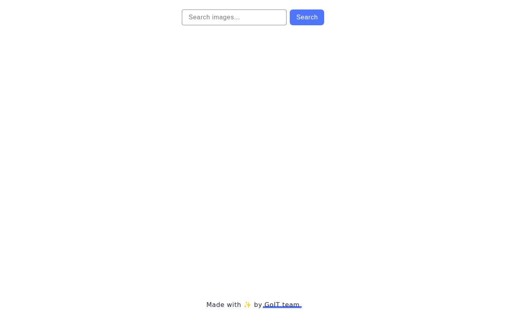

### 🌐 Виберіть для Вас комфортну мову:

[🇺🇦 Українська](README.md) | [🇬🇧 English](README.en.md) |
[🇩🇪 Deutsch](README.de.md)

# GoIT JS HW-10 — Таймер та Snackbar

<!-- AUTOGEN:STATS -->
[](https://developer.mozilla.org/en-US/docs/Web/HTML) [](https://developer.mozilla.org/en-US/docs/Web/CSS) [](https://developer.mozilla.org/en-US/docs/Web/JavaScript) [](https://support.apple.com/guide/terminal/welcome/mac) [](https://code.visualstudio.com/) [](https://github.com/) [](https://www.figma.com/) 

[](https://github.com/VuToV-Mykola/goit-js-hw-10/graphs/traffic)
[](https://github.com/VuToV-Mykola/goit-js-hw-10/actions/workflows/screenshot-and-visitor.yaml)
[](https://github.com/VuToV-Mykola/goit-js-hw-10)
[](https://github.com/VuToV-Mykola/goit-js-hw-10/blob/main/LICENSE)

## 📸 Скріншот проекту

<!-- END:AUTOGEN -->

## 🎯 Про проєкт

Це домашнє завдання №10 з JavaScript. Реалізовано:
- таймер з вибором дати та часу через `flatpickr`;
- snackbar-сповіщення для промісів через `iziToast`.

## 🧩 Функціонал

- Валідація дати: старт лише для майбутніх значень.
- Запуск таймера з блокуванням інпута.
- Форматування часу у двозначному вигляді.
- Створення промісу із затримкою та відображення результату.
- Нотифікації про успішні та відхилені проміси.

## 🛠 Технології

- HTML5
- CSS3
- JavaScript (ES2025)
- Vite
- flatpickr
- iziToast

## 🔌 Підключення flatpickr

1. Встановити залежність:
```bash
npm install flatpickr
```

2. Імпортувати бібліотеку та стилі:
```js
import flatpickr from 'flatpickr';
import 'flatpickr/dist/flatpickr.min.css';
```

3. Ініціалізувати пікер:
```js
flatpickr('#datetime-picker', {
  enableTime: true,
  time_24hr: true,
  defaultDate: new Date(),
  minuteIncrement: 1,
});
```

## 🔌 Підключення iziToast

1. Встановити залежність:
```bash
npm install izitoast
```

2. Імпортувати бібліотеку та стилі:
```js
import iziToast from 'izitoast';
import 'izitoast/dist/css/iziToast.min.css';
```

3. Використати для нотифікацій:
```js
iziToast.success({
  title: 'OK',
  message: 'Fulfilled promise in 500ms',
});
```

## 📁 Структура

```
goit-js-hw-10/
├── src/
│   ├── 1-timer.html
│   ├── 2-snackbar.html
│   ├── css/
│   │   ├── timer.css
│   │   ├── snackbar.css
│   │   └── styles.css
│   └── js/
│       ├── 1-timer.js
│       └── 2-snackbar.js
├── package.json
└── README.md
```

## 🚀 Запуск

1. Встановити залежності:
```bash
npm install
```

2. Запустити dev-сервер:
```bash
npm run dev
```

3. Відкрити сторінки:
- `http://localhost:5173/1-timer.html`
- `http://localhost:5173/2-snackbar.html`

## ✅ Валідація

- HTML: https://validator.w3.org/
- CSS: https://jigsaw.w3.org/css-validator/
- JS: https://jshint.com/

## 🔗 Корисні посилання

- [Технічне завдання](https://www.edu.goit.global/ru/learn/35708569/18936918/20351639/homework)
- [Stylelint Rules](https://stylelint.io/user-guide/rules)
- [Code Guide](https://codeguide.co/)

## 📐 ТЗ

### Завдання 1 - Таймер

Виконуй це завдання у файлах `1-timer.html` і `1-timer.js`.
Створи таймер з можливістю вибору дати та часу через `flatpickr`.

Основні вимоги:
- Інпут має id `datetime-picker`, а кнопка старту — атрибут `data-start`.
- Кнопка старту неактивна, поки не вибрано майбутню дату.
- Якщо обрана дата в минулому, показуй `iziToast` з повідомленням про помилку.
- Після старту таймера інпут і кнопка блокуються.
- Значення часу оновлюються кожну секунду у полях `data-days`, `data-hours`, `data-minutes`, `data-seconds`.
- Значення форматуються до двох цифр.

### Завдання 2 - Snackbar

Виконуй це завдання у файлах `2-snackbar.html` і `2-snackbar.js`.
Створи форму для запуску промісу із затримкою та виведенням результату.

Основні вимоги:
- Поле `delay` приймає затримку в мілісекундах.
- Радіокнопки `state` визначають, чи проміс виконається (`fulfilled`) або відхилиться (`rejected`).
- Після сабміту створюється проміс і через `iziToast` показується результат:
  - `Fulfilled promise in Xms`
  - `Rejected promise in Xms`

